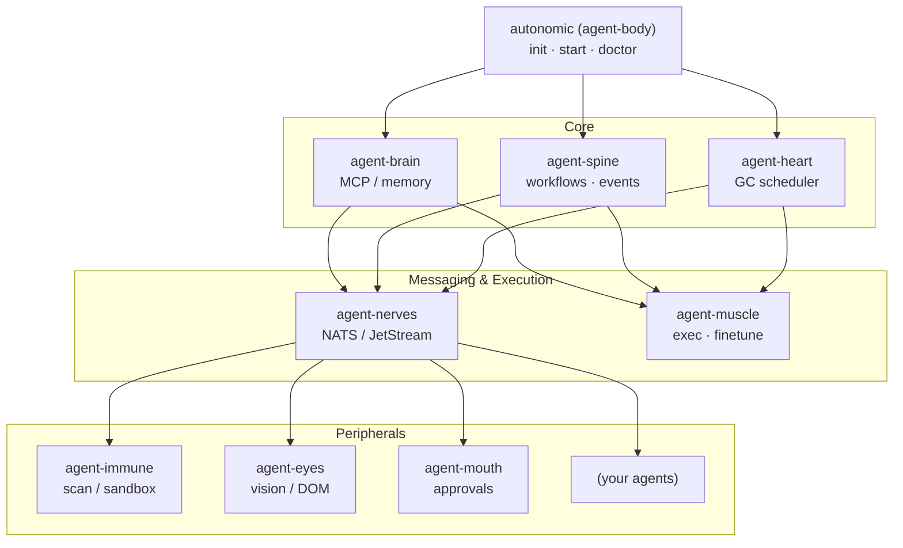

# 🧬 Autonomic AI

The Unix Philosophy applied to Autonomous Software Engineering.

Structure beats intelligence. Deterministic execution over probabilistic hallucination. Built entirely in Rust.

## 🛑 The Problem: The Python Monolith

The current generation of autonomous AI agents (Devin, AutoGPT, LangGraph) suffer from three fatal engineering flaws:

- **The Monolith Trap**: They attempt to handle prompt generation, memory retrieval, tool execution, and state management inside massive, single-process Python loops. When one tool fails, the entire runtime crashes.
- **Context Collapse**: Pushing 100K+ tokens of conversation history into a single prompt leads to severe "Lost in the Middle" syndrome, infinite hallucination loops, and astronomical API costs.
- **Zero Data Sovereignty**: Enterprise engineering teams legally cannot send proprietary, unreleased source code to third-party cloud agents.

## ⚡ The Solution: Biological Separation of Concerns

Autonomic AI rejects the monolith. We treat AI architecture like biological evolution: discrete, highly-specialized organs communicating over strict, type-safe interfaces (MCP).

By providing mathematically strict workflow structures and perfectly precise memory retrieval, we enable tiny, highly quantized local models (like 1.5B or 8B parameters) to achieve the same execution reliability as massive $1,000/month cloud agents. All while remaining 100% local, private, and sovereign.

## 🫀 The Architecture (The Anatomy)

Our stack is completely decoupled. You do not need to adopt the whole body to use the organs.

### The Core Triad

- **agent-brain** — The Memory Layer. A low-latency Rust context router. Instead of "Mega-prompts," it uses a local SQLite + filterable HNSW vector index to route only the exact ~500 tokens of context strictly required for the current micro-task.
- **agent-spine** — The Execution Layer. A deterministic orchestration engine. It parses declarative YAML workflows into massive parallel DAGs using tokio. It features immutable state-transition logs for time-travel debugging and strict Human-in-the-Loop (HITL) approval gates.
- **agent-heart** — The Background Pulse. A background daemon that dynamically allocates API budgets, enforces global safety rules (blocking destructive bash commands at the AST layer), and runs cron jobs for memory distillation.

### The Ecosystem (Peripherals)

- **agent-immune** — Dependency fuzzing, AST linting, and sandboxed Firecracker/Docker execution to ensure generated code is perfectly safe.
- **agent-eyes** — Playwright-based visual QA and a LangSmith-style real-time observability dashboard.
- **agent-nerves** — Distributed nats.rs pub/sub event bus for asynchronous, multi-node agent communication.
- **agent-muscle** — Remote actuators handling massive local compilations, Kubernetes execution, and local LoRA model fine-tuning.
- **agent-mouth** — The communication layer translating complex JSON workflow states into human-readable Slack/Discord summaries and ChatOps triggers.
- **agent-body** — The sovereign meta-framework, shared core crate, and unified CLI installer that binds all organs together.

## 🔒 Why Developers Trust This Stack

- **No "Magic" Prompts**: We do not rely on the LLM to dynamically figure out what to do next. `agent-spine` dictates the exact DAG workflow. The LLM is only used as a micro-translator for tiny, isolated tasks.
- **Zero Telemetry**: The ecosystem runs natively on your machine. Your codebase, your database, your secrets. Nothing leaves your laptop unless you explicitly configure a remote LLM API.
- **Memory Safety & Concurrency**: Written purely in Rust. Sub-millisecond state transitions, no Python GIL bottlenecks, and complete memory safety.

## 🤝 The Organism

Autonomic AI is completely open-source. Because of our strict separation of concerns, the codebase remains remarkably clean and approachable. You do not need to understand the DAG orchestration engine (spine) to optimize the vector search (brain).

We are building the sovereign software engineer of the future.

---

## `agent-body` CLI

**Meta-framework and unified CLI for the Autonomic AI ecosystem.**

`agent-body` installs as the `agent-body` binary and exposes the **`autonomic`** CLI (symlinked on install). It scaffolds the shared workspace, supervises core daemons, routes commands to peripheral organs, and ships `agent-body-core` — the shared types and NATS schemas every organ uses.

---

## Architecture

Each organ is **independently useful** (its own binary, config section, CLI, and HTTP API) and **designed to integrate** through shared paths, NATS JetStream, and the agent-spine event bus.



| Integration surface | Purpose |
|---------------------|---------|
| `~/.autonomic/config.toml` | One file, `[organ]` sections per daemon |
| `agent-body-core` | Shared NATS subjects, JetStream stream, workspace paths |
| agent-spine `:3100` | Organ registration, heartbeats, domain events |
| NATS (`agent-nerves`) | Async jobs: compute, train requests, bus messages |

---

## Quick start

### 1. Install all organs (recommended)

```bash
curl -fsSL https://raw.githubusercontent.com/autonomic-ai-dev/agent-body/master/scripts/install-all-organs.sh | bash
export PATH="$HOME/.local/bin:$PATH"
```

This downloads release binaries for **agent-body** and all eight peripheral organs, links `autonomic` → `agent-body`, runs **`autonomic init`**, and verifies with **`autonomic doctor`**.

Install only the meta CLI:

```bash
curl -fsSL https://raw.githubusercontent.com/autonomic-ai-dev/agent-body/master/scripts/install.sh | bash
ln -sf ~/.local/bin/agent-body ~/.local/bin/autonomic   # optional symlink
```

### 2. Initialize workspace

```bash
autonomic init                  # creates ~/.autonomic/ and config.toml sections
autonomic init --name my-app    # optional project directory
```

### 3. Verify and start core daemons

```bash
autonomic doctor                # all organ binaries on PATH?
autonomic update                # print installed versions
autonomic start                 # nerves + heart (ordered, health-checked)
autonomic status                # workspace paths + supervisor state
```

### 4. Route to any organ

```bash
autonomic brain serve           # → agent-brain …
autonomic spine serve           # → agent-spine …
autonomic muscle train --backend auto
autonomic eyes dom stats
```

---

## Commands

| Command | Description |
|---------|-------------|
| `autonomic init [--name DIR]` | Create `~/.autonomic/` workspace and unified config |
| `autonomic start` | Start supervised daemons (nerves, heart) |
| `autonomic stop` / `restart` | Stop or restart supervised daemons |
| `autonomic supervise` | Watch and restart unhealthy daemons |
| `autonomic doctor` | Verify organ binaries and workspace |
| `autonomic update` | List installed organ versions on PATH |
| `autonomic status` | Workspace paths + supervisor table |
| `autonomic tui` | Live CPU/RAM for autonomic processes |
| `autonomic <organ> …` | Proxy to `agent-{organ}` (brain, spine, heart, …) |

---

## Integration smoke test

From a local checkout:

```bash
bash scripts/smoke-integration.sh
# optional: start daemons and probe HTTP health
AUTONOMIC_SMOKE_HTTP=1 bash scripts/smoke-integration.sh
```

---

## Workspace layout

| Path | Purpose |
|------|---------|
| `~/.autonomic/config.toml` | Unified organ configuration |
| `~/.autonomic/memory/` | agent-brain store |
| `~/.autonomic/broker/` | NATS / JetStream persistence |
| `~/.autonomic/logs/spine/` | Workflow and execution state |
| `~/.autonomic/state/<organ>/` | Per-organ runtime state |

---

## Peripheral organs

| Organ | Port | Role |
|-------|------|------|
| [agent-brain](../agent-brain) | MCP stdio | Context routing, memory, MCP |
| [agent-spine](../agent-spine) | 3100 | YAML workflows, event bus |
| [agent-heart](../agent-heart) | 3101 | Scheduled agent-brain GC |
| [agent-nerves](../agent-nerves) | 3102 | NATS / JetStream bus |
| [agent-muscle](../agent-muscle) | 3103 | Command execution, LoRA training |
| [agent-mouth](../agent-mouth) | 3104 | Slack approvals, webhooks |
| [agent-eyes](../agent-eyes) | 3105 | Capture, DOM index, VLM |
| [agent-immune](../agent-immune) | 3106 | OSV scan, sandbox |

Each repo includes its own `scripts/install.sh` if you prefer to install organs individually.

---

## Development

```bash
cargo test --release -p agent-body -p agent-body-core
cargo build --release -p agent-body
```

---

## License

MIT
