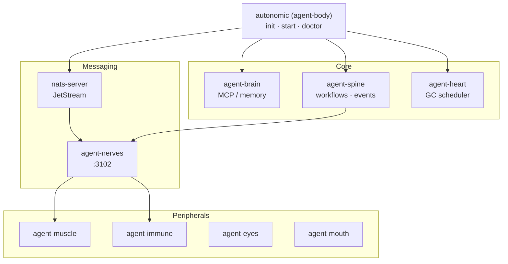

# agent-body

**Ecosystem manager and unified CLI — installs organs, scaffolds workspace, supervises NATS and core daemons.**

Part of the **[Autonomic AI](https://github.com/autonomic-ai-dev/agent-body)** stack. Installs as `agent-body` and exposes the **`autonomic`** command (symlinked on install). Routes to every peripheral organ, owns `~/.autonomic/`, and ships `agent-body-core` (shared NATS subjects and workspace types).

| Standalone | Integrated |
|------------|------------|
| `autonomic init` / `doctor` | All organs share `~/.autonomic/config.toml` |
| `autonomic start` (NATS + nerves + heart) | agent-spine event bus on `:3100` |
| `autonomic <organ> …` proxy | JetStream stream `AUTONOMIC` via agent-nerves |

---

## Why agent-body?

Three problems hit every team wiring multiple agent tools together:

1. **Fragmented install** — eight organ binaries, eight configs, no single “is this healthy?” command.
2. **Broker bootstrap** — NATS/JetStream must run before nerves, muscle, and spine async paths work; easy to forget.
3. **No supervisor** — daemons die silently; nothing restarts nerves or heart after a laptop sleep.

**agent-body fixes this with one meta-CLI:**

| Problem | agent-body answer |
|---------|-------------------|
| Scattered installs | **`install-all-organs.sh`** — all release binaries + `nats-server` + `autonomic init` |
| Missing NATS | **`autonomic start`** — ordered supervisor: `nats-server -js` → `agent-nerves` → `agent-heart` |
| Unknown system state | **`autonomic doctor`** / **`status`** — binary checks + PID/health table |
| Per-organ CLIs | **`autonomic brain serve`** — proxies to `agent-{organ}` with shared config |

Structure beats intelligence. Deterministic execution over probabilistic hallucination.

---

## Quick Install

Install every organ + NATS + workspace scaffold:

```bash
curl -fsSL https://raw.githubusercontent.com/autonomic-ai-dev/agent-body/master/scripts/install-all-organs.sh | bash
export PATH="$HOME/.local/bin:$PATH"
```

Meta CLI only:

```bash
curl -fsSL https://raw.githubusercontent.com/autonomic-ai-dev/agent-body/master/scripts/install.sh | bash
ln -sf ~/.local/bin/agent-body ~/.local/bin/autonomic
```

Verify and start the local stack:

```bash
autonomic doctor
autonomic start          # nats-server (JetStream) → agent-nerves → agent-heart
autonomic status
export AUTONOMIC_NATS_URL=nats://localhost:4222   # if not already set
```

---

## Main features

| Feature | Setup | Why use it |
|---------|-------|------------|
| **Full organ install** | `install-all-organs.sh` | One curl — all binaries, NATS, brain MCP hooks |
| **Unified workspace** | `autonomic init` | Single `~/.autonomic/config.toml` for every organ |
| **Daemon supervisor** | `autonomic start` | Ordered NATS + nerves + heart with health probes |
| **Organ router** | `autonomic brain …` | Same flags as `agent-brain` without memorizing names |
| **Legacy migration** | install script | Moves old `~/.agent_*` dirs into `~/.autonomic/` |
| **Integration packages** | post-install | `@supervisor` + `@starter` via agent-brain |
| **Health & versions** | `doctor`, `update` | Pre-flight before CI or local workflows |

---

## Commands

| Command | Description |
|---------|-------------|
| `autonomic init [--name DIR]` | Create `~/.autonomic/` workspace and unified config |
| `autonomic start` | Start supervised daemons: **nats-server**, agent-nerves, agent-heart |
| `autonomic stop` / `restart` | Stop or restart supervised daemons |
| `autonomic supervise` | Watch and restart unhealthy daemons |
| `autonomic doctor` | Verify organ binaries and workspace |
| `autonomic update` | List installed organ versions on PATH |
| `autonomic status` | Workspace paths + supervisor PID/health table |
| `autonomic tui` | Live CPU/RAM for autonomic processes |
| `autonomic <organ> …` | Proxy to `agent-{organ}` (brain, spine, heart, …) |

---

## Architecture



| Integration surface | Purpose |
|---------------------|---------|
| `~/.autonomic/config.toml` | One file, `[organ]` sections per daemon |
| `agent-body-core` | Shared NATS subjects, JetStream stream, workspace paths |
| agent-spine `:3100` | Organ registration, heartbeats, domain events |
| NATS (`agent-nerves`) | Async jobs: compute, train requests, bus messages |

---

## Peripheral organs

| Organ | Port | Role |
|-------|------|------|
| [agent-brain](https://github.com/autonomic-ai-dev/agent-brain) | MCP stdio | Context routing, memory, MCP |
| [agent-spine](https://github.com/autonomic-ai-dev/agent-spine) | 3100 | YAML workflows, event bus |
| [agent-heart](https://github.com/autonomic-ai-dev/agent-heart) | 3101 | Scheduled agent-brain GC |
| [agent-nerves](https://github.com/autonomic-ai-dev/agent-nerves) | 3102 | NATS / JetStream bus |
| [agent-muscle](https://github.com/autonomic-ai-dev/agent-muscle) | 3103 | Command execution, LoRA training |
| [agent-mouth](https://github.com/autonomic-ai-dev/agent-mouth) | 3104 | Slack approvals, webhooks |
| [agent-eyes](https://github.com/autonomic-ai-dev/agent-eyes) | 3105 | Capture, DOM index, VLM |
| [agent-immune](https://github.com/autonomic-ai-dev/agent-immune) | 3106 | OSV scan, sandbox |

Each repo includes its own `scripts/install.sh` if you prefer to install organs individually.

---

## Workspace layout

| Path | Purpose |
|------|---------|
| `~/.autonomic/config.toml` | Unified organ configuration |
| `~/.autonomic/memory/` | agent-brain store |
| `~/.autonomic/broker/` | NATS / JetStream persistence |
| `~/.autonomic/logs/spine/` | Workflow and execution state |
| `~/.autonomic/state/<organ>/` | Per-organ runtime state |
| `~/.autonomic/state/supervisor/` | PID files and daemon logs |

---

## Local setup

```bash
git clone https://github.com/autonomic-ai-dev/agent-body.git && cd agent-body
cargo build --release -p agent-body
./target/release/agent-body init
export PATH="$PWD/target/release:$PATH"
autonomic start
bash scripts/smoke-integration.sh
AUTONOMIC_SMOKE_HTTP=1 bash scripts/smoke-integration.sh
```

---

## Development

```bash
cargo test --release -p agent-body -p agent-body-core
cargo build --release -p agent-body
```

---

## Releases

See [CHANGELOG.md](CHANGELOG.md). Tags `v*` publish platform binaries with changelog-based release notes.

## License

MIT
