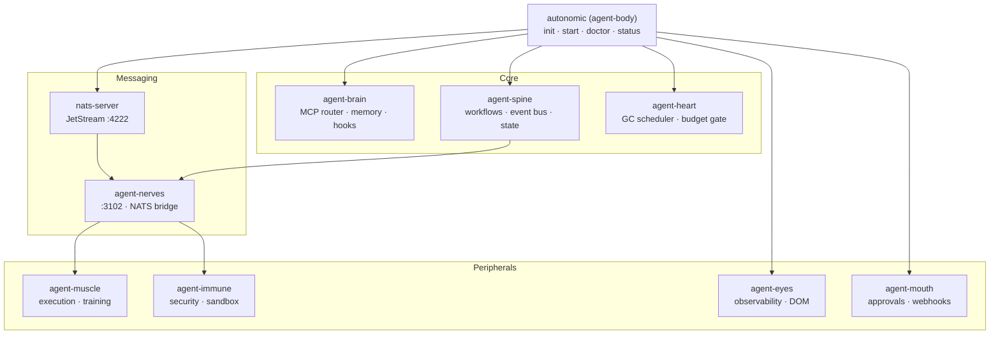

# agent-body — The Autonomic Control Plane

**Cloud-Native role: Control plane** (`kubectl` / apiserver analog) — unified CLI, daemon supervisor, and workspace scaffold.

`agent-body` is the **Control Plane** for the Autonomic cluster. It provides the **`autonomic`** meta-CLI, manages the shared `~/.autonomic/` workspace, and acts as the local process supervisor (like `systemd` or `kubelet`) for all isolated daemons.

Without `agent-body`, you would have to manually configure, boot, and monitor 8 different binaries. With it, you run a single command (`autonomic start`) to boot the entire cluster in the correct topological order.

---

## Under the Hood: How it Works

Autonomic AI rejects monolithic agent design in favor of **cloud-native microservices**. But microservices require orchestration. `agent-body` solves this via three mechanisms:

1. **Topological Boot Ordering (Supervisor)**
When you run `autonomic start`, it doesn't just launch processes blindly. It spawns the NATS message broker first, probes it for readiness, then spawns `agent-nerves` (the mesh), then boots the dependent daemons (`muscle`, `immune`, etc.). If a daemon crashes due to a memory leak, the supervisor catches the exit code and automatically restarts it with exponential backoff.

2. **Unified Configuration Plane**
Instead of 8 different config files, `agent-body` provides `autonomic init` which scaffolds a single `~/.autonomic/config.toml`. All daemons dynamically load their specific `[sections]` from this unified file, ensuring port assignments and NATS URLs are perfectly synchronized.

3. **The MCP API Gateway**
`agent-body` implements `autonomic serve-mcp`. This acts as a gateway that dynamically queries all running daemons over the NATS bus, aggregates their available tools, and exposes a single, massive MCP server to your external LLM orchestrator (like Cursor or Claude Desktop).



---

## Standalone vs Integrated

| Mode | What you type | What happens |
|------|--------------|--------------|
| **Standalone** | `agent-body init` | Creates `~/.autonomic/` workspace and unified config |
| **Standalone** | `agent-body doctor` | Checks all organ binaries on PATH |
| **Standalone** | `autonomic brain serve` | Proxies to `agent-brain` with shared config |
| **Integrated** | `autonomic start` | Ordered launch: NATS → nerves → heart, with health probes |
| **Integrated** | `autonomic status` | PID table, health state, port assignments |
| **Integrated** | `autonomic stop` | Graceful shutdown of supervised daemons |

In standalone mode, organs are independent binaries with their own configs. In integrated mode, they share `~/.autonomic/config.toml`, register on the spine event bus, and communicate via NATS JetStream. agent-body manages the transition between both modes seamlessly.

---

## Why agent-body?

Every team that wires multiple agent tools together hits the same three problems:

1. **Fragmented install** — eight organ binaries, eight config paths, eight `--help` menus. No single "is this healthy?" command exists.
2. **Broker bootstrap** — NATS with JetStream must run before nerves, muscle, and spine async paths work. Forgetting the broker means silent failures.
3. **Daemon supervision** — organs die silently after laptop sleep or network partitions. Nothing restarts them automatically.

agent-body solves all three with a single meta-CLI:

| Problem | agent-body answer |
|---------|-------------------|
| Scattered installs | `install-all-organs.sh` installs all release binaries + `nats-server` + runs `autonomic init` |
| Missing broker | `autonomic start` orders startup: `nats-server -js` → `agent-nerves` → `agent-heart` |
| Unknown system state | `autonomic doctor` and `status` show binary health + PID table + port assignments |
| Per-organ CLIs | `autonomic <organ> <args>` proxies to `agent-{organ}` with shared config |
| Config duplication | One `~/.autonomic/config.toml` with `[brain]`, `[spine]`, `[heart]`, etc. sections |

---

## What you get

| Feature | Why use it |
|---------|------------|
| **Full organ install** | One `curl` — all binaries, NATS server, brain MCP hooks |
| **Unified workspace** | `autonomic init` creates a single config to rule them all |
| **Daemon supervisor** | Ordered NATS + nerves + heart with health probes and restart |
| **Organ router** | `autonomic brain …` — same flags as `agent-brain` |
| **Legacy migration** | Install script migrates old `~/.agent_*` dirs into `~/.autonomic/` |
| **Integration packages** | Post-install adds `@supervisor` + `@starter` via agent-brain |
| **Health dashboard** | `doctor`/`update` — pre-flight checks before CI or local workflows |
| **Live TUI** | `autonomic tui` — CPU/RAM monitoring for all organ processes |

---

## Commands

| Command | Description |
|---------|-------------|
| `autonomic init` | Create `~/.autonomic/` workspace and unified config |
| `autonomic start` | Start supervised daemons: nats-server → nerves → heart |
| `autonomic stop` / `restart` | Stop or restart supervised daemons |
| `autonomic supervise` | Watch and restart unhealthy daemons |
| `autonomic doctor` | Verify organ binaries and workspace health |
| `autonomic update` | List installed organ versions on PATH |
| `autonomic status` | Workspace paths + supervisor PID/health table |
| `autonomic tui` | Live CPU/RAM dashboard for autonomic processes |
| `autonomic <organ> …` | Proxy any command to `agent-{organ}` |

---

## Quick Install

Three paths:

| Path | Command |
|------|---------|
| **curl (all organs)** | `curl -fsSL …/install-all-organs.sh \| bash` |
| **curl (meta CLI only)** | `curl -fsSL …/install.sh \| bash` |
| **Homebrew (macOS)** | `brew tap autonomic-ai-dev/tap && brew install autonomic-stack` |

### curl — full stack

```bash
curl -fsSL https://raw.githubusercontent.com/autonomic-ai-dev/agent-body/master/scripts/install-all-organs.sh | bash
export PATH="$HOME/.local/bin:$PATH"
```

### curl — meta CLI only

```bash
curl -fsSL https://raw.githubusercontent.com/autonomic-ai-dev/agent-body/master/scripts/install.sh | bash
ln -sf ~/.local/bin/agent-body ~/.local/bin/autonomic
```

### Homebrew (macOS)

```bash
brew tap autonomic-ai-dev/tap
brew install autonomic          # agent-body binary + autonomic symlink
brew install autonomic-stack  # all organ release binaries + nats-server
```

See [config.full.example.toml](docs/config.full.example.toml) for integrated `~/.autonomic/config.toml` samples per organ.

Verify:
```bash
autonomic doctor
autonomic start
autonomic status
```

---

## Integration Architecture

The integration surface between organs is defined by three layers:

| Layer | Protocol | Purpose |
|--------|----------|---------|
| **Config** | `~/.autonomic/config.toml` | One file with `[organ]` sections per daemon |
| **Events** | agent-spine HTTP `:3100` | Organ registration, heartbeats, domain events |
| **Async** | NATS JetStream via nerves | Compute jobs, train requests, bus messages |

### Port assignments

| Organ | Port | Role |
|-------|------|------|
| agent-brain | (MCP stdio) | Context routing, memory, MCP tools |
| agent-spine | 3100 | YAML workflows, event bus, dashboard |
| agent-heart | 3101 | Scheduled GC, token budget gate |
| agent-nerves | 3102 | NATS/JetStream bridge + cluster |
| agent-muscle | 3103 | Command execution, LoRA training |
| agent-mouth | 3104 | Slack approvals, webhooks |
| agent-eyes | 3105 | Capture, DOM index, VLM |
| agent-immune | 3106 | OSV scan, sandbox |

---

## Workspace Layout

| Path | Purpose |
|------|---------|
| `~/.autonomic/config.toml` | Unified organ configuration |
| `~/.autonomic/AGENTS.md` | Composed vendor-neutral agent mode (symlinked to hosts) |
| `~/.autonomic/agents/` | Per-organ mode fragments (`base.md`, `brain.md`, …) |
| `~/.autonomic/memory/` | agent-brain knowledge store |
| `~/.autonomic/broker/` | NATS/JetStream persistence |
| `~/.autonomic/logs/spine/` | Workflow execution history |
| `~/.autonomic/state/<organ>/` | Per-organ runtime state |
| `~/.autonomic/state/supervisor/` | PID files and daemon logs |

---

## Development

```bash
git clone https://github.com/autonomic-ai-dev/agent-body.git && cd agent-body
cargo build --release -p agent-body
./target/release/agent-body init
export PATH="$PWD/target/release:$PATH"
autonomic start
bash scripts/smoke-integration.sh
```

---

## License

MIT
